import { Tabs, TabItem, Steps } from "@astrojs/starlight/components";

<Tabs>
   <TabItem label="MYSQL">

### Windows

<Steps>

1. 点击 [这里](https://dev.mysql.com/downloads/installer/) 下载 `Windows` 的安装包，带 `Web` 的是在线安装包，比离线安装包要小一点

    你为服务器安装的话，基本上第一个选 `server only` 就行，他自带的客户端不怎么好用，最大的缺点就是对中文用户不友好

    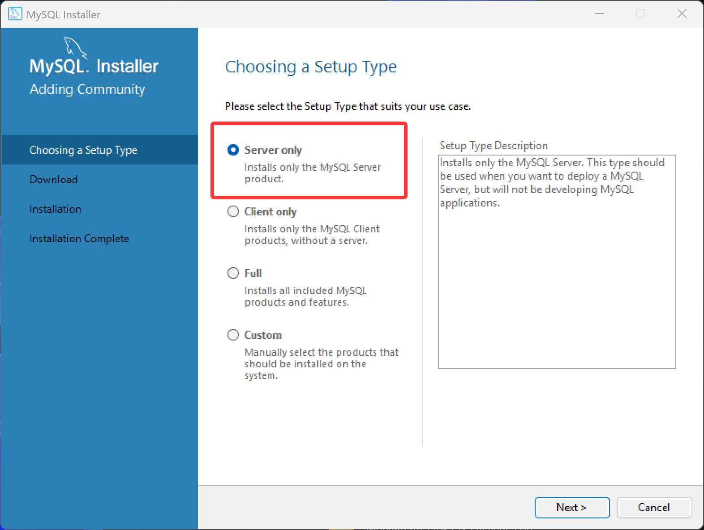

2. 这里直接下一步，然后你可以看到你可以设置安装路径和数据存储路径，请按需改。

    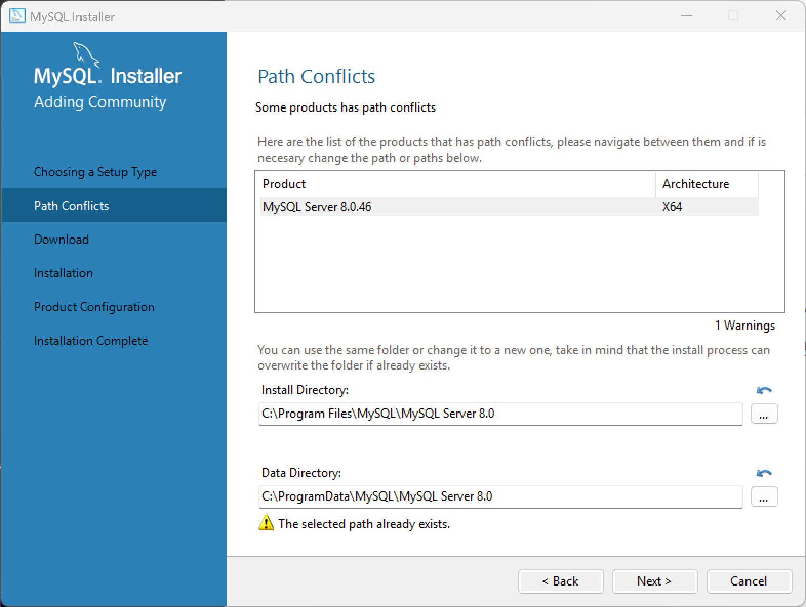

3. 下一步然后点 Execute，然后一路下一步，来到这个界面，这里 `Config Type` 我们选 `Server Computer`，其他设置按照你自己需求更改，然后 Next。

    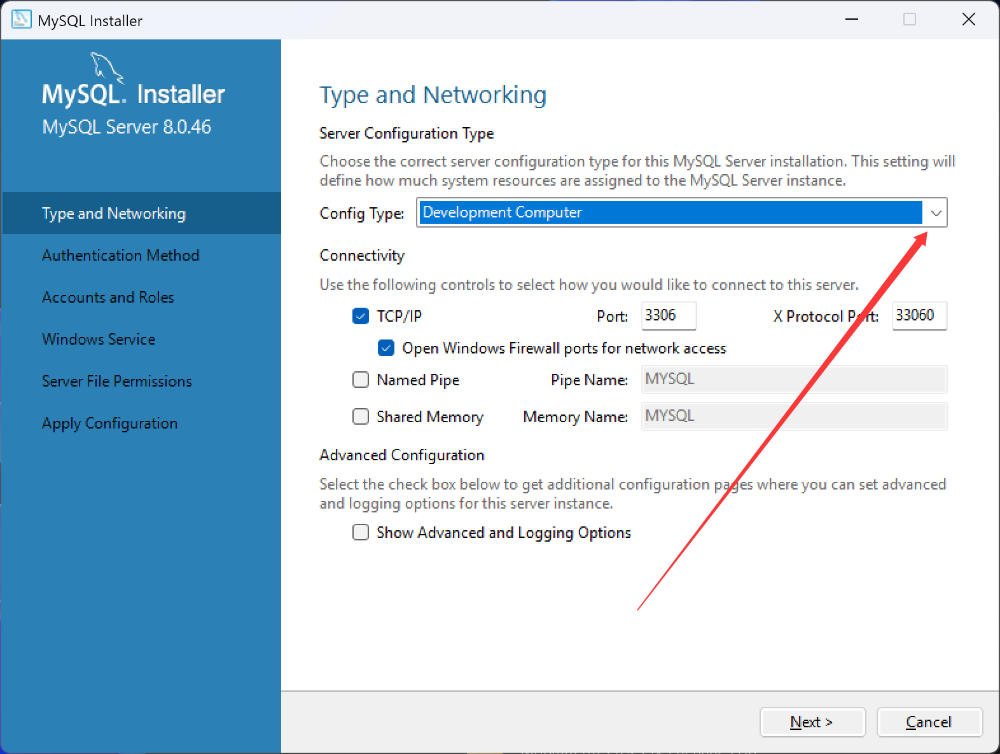

    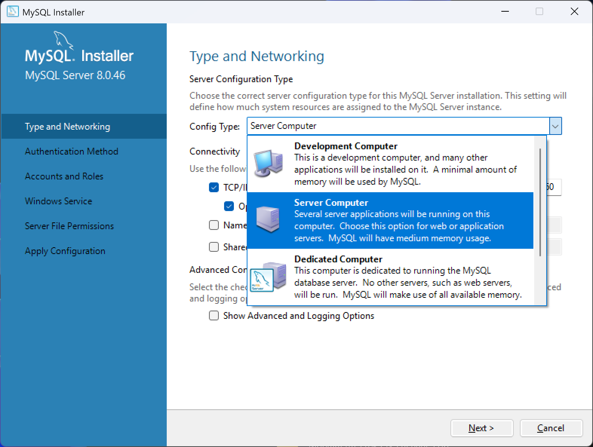

4. 这里我们直接默认就好了，Next

    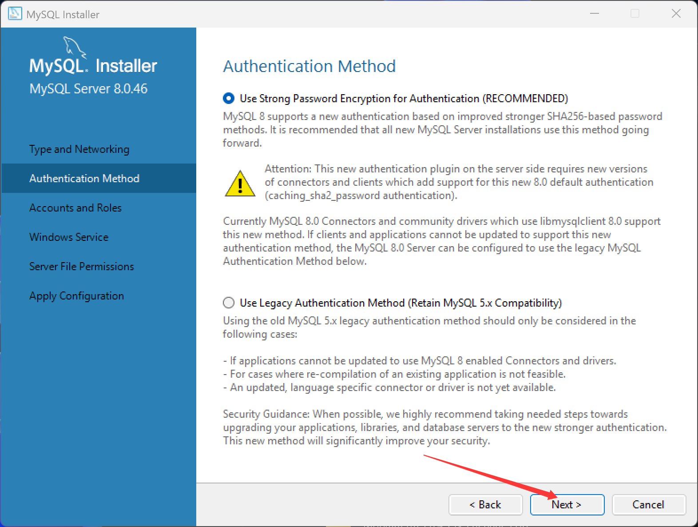

5. 接下来就是设置你的 `root` 密码，切勿忘记，然后你在下方还可以设置其他用户，我建议你使用工具来创建对应数据库的对应用户

    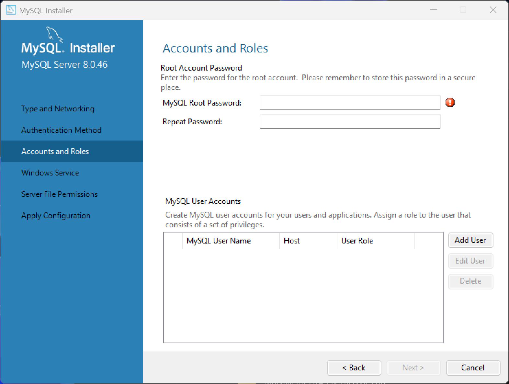

6. 这个页面我们直接 Next，基本上不需要配置什么

    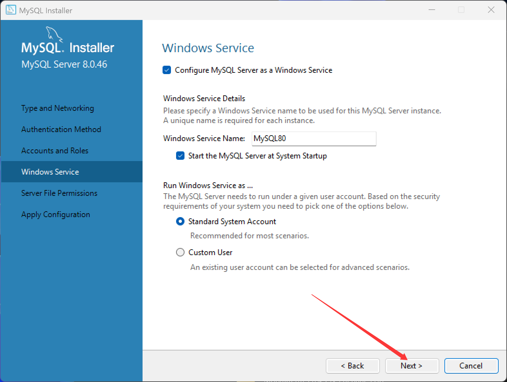

    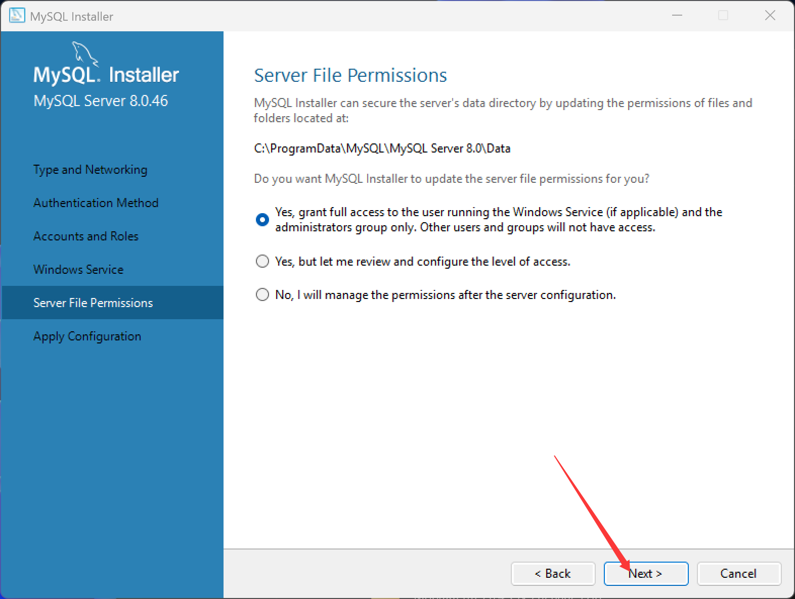

7. 点 Execute，又点 Execute 然后你就安装成功了

</Steps>

### Linux

<Steps>

1. 在 [这里](https://dev.mysql.com/downloads/) 下载 `yum` 或者 `apt` 的仓库，并且把这个文件放到你机器上的文件夹里

    安装仓库的命令：

    ```bash
    # 适用于 Debian 系
    sudo dpkg -i <你刚才下载文件的绝对路径>
    # 适用于 Redhat 系
    sudo yum localinstall <你刚才下载文件的绝对路径>
    # 或者使用 dnf
    sudo dnf localinstall <你刚才下载文件的绝对路径>
    ```

    Debian 系的额外步骤：`sudo apt-get update`

2. 选择版本：

    ```bash
    # 适用于 Debian 系
    sudo dpkg-reconfigure mysql-apt-config
    # 它会弹出一个东西让你选择的，选择自己想要的版本，然后点 Ok。
    sudo apt-get update
    # 适用于 Red Hat 系
    yum repolist all | grep mysql
    # 或者使用 dnf
    dnf repolist all | grep mysql
    # 执行完这个命令以后，你会在终端里看到一长串的子仓库。
    # 建议使用 9.7 LTS 版本
    # 下面的命令可以用来禁用子仓库和启用子仓库。
    sudo yum-config-manager --disable <子仓库>
    sudo yum-config-manager --enable <子仓库>
    # 或者使用 dnf
    sudo dnf config-manager --disable <子仓库>
    sudo dnf config-manager --enable <子仓库>
    ```

    确认正确的子仓库已被启用，通过执行以下命令并检查其输出（对于支持 dnf 的系统，命令中的 `yum` 替换为 `dnf` ）

    ```bash
    yum repolist enabled | grep mysql
    ```

    :::tip

    基于 `EL8` 的系统，如 `RHEL8` 和 `Oracle`。`Linux 8` 包含默认启用的 `MySQL` 模块。除非该模块被禁用，否则它会掩盖以下提供的包 `MySQL` 仓库。要禁用附带的模块并 `MySQL` 仓库包可见，请使用以下命令（对于支持 dnf 的系统，将命令中的 `yum` 替换为 `dnf` ）

    ```bash
    sudo yum module disable mysql
    ```

    :::

3. 安装 `MySQL`

    ```bash
    # 适用于 Debian 系
    sudo apt-get install mysql-server
    # 这会安装 MySQL 服务器的包，以及客户端和数据库的通用文件包。
    # 安装的过程中会要求你输入你 MySQL root 用户密码。
    # 适用于 Red Hat 系
    sudo yum install mysql-community-server
    # 或者
    sudo dnf install mysql-community-server
    # 这将安装 MySQL 服务器的软件包 (mysql-community-server)，以及运行服务器所需的组件软件包，包括客户端软件包 (mysql-community-client)、客户端和服务器的通用错误消息和字符集 (mysql-community-common) 以及共享客户端库 (mysql-community-libs)。
    ```

4. 启动 `MySQL` 服务器和停止 `MySQL` 服务器

    ```bash
    # 适用于 Debian 系
    systemctl start mysql #启动
    systemctl stop mysql #停止
    systemctl status mysql #状态查看
    systemctl restart mysql #重启
    # 适用于 Red Hat 系
    systemctl start mysqld #启动
    systemctl stop mysqld #停止
    systemctl status mysqld #状态查看
    systemctl restart mysqld #重启
    ```

    在 `MySQL` 服务器的首次启动时，如果服务器的数据目录为空，将会发生以下情况。

    （`Debian` 系用户可以跳过查看超级用户密码和重新设置超级用户密码的步骤）
    - 服务器将被初始化。
    - SSL 证书和密钥文件将在数据目录中生成。
    - [`validate_password`](https://dev.mysqlserver.cn/doc/refman/8.4/en/validate-password.html) 将被安装并启用。
    - 将创建一个超级用户帐户 `'root'@'localhost`。超级用户的密码将被设置并存储在错误日志文件中。要查看它，请使用以下命令。

    ```bash
    sudo grep 'temporary password' /var/log/mysqld.log
    ```

5. 尽快更改 root 密码，方法是使用生成的临时密码登录并为超级用户帐户设置自定义密码。

    ```bash
    $> mysql -uroot -p
    mysql> ALTER USER 'root'@'localhost' IDENTIFIED BY '<自定义密码>';
    ```

</Steps>

### Docker

如果你要用 Docker 部署，建议在 Linux 上用（Windows 上的 Docker Desktop 兼容性和性能都差一些）。不过总体来说，更推荐用前面原生安装的方式，Docker 部署对新手来说排查问题会更麻烦。

拉取镜像的命令：

```bash
docker pull mysql:<要安装的版本>
```

启动实例的命令：

```bash
docker run --name=<容器名称> \
  -e MYSQL_ROOT_PASSWORD=<root用户密码> \
  --restart on-failure \
  -p 3306:3306 \
  -d \
  -v <数据在你机器上的存放位置>:/var/lib/mysql \
  -v <配置目录在你机器上的存放位置>:/etc/mysql/conf.d \
  -v <日志在你机器上的存放位置>:/var/log/mysql \
  mysql:<版本号>
```

  </TabItem>

  <TabItem label="Redis">

### Windows

<Steps>

1. 请你把你电脑上的 WSL 功能打开

2. 点击 [这里](https://www.docker.com/products/docker-desktop/) 下载并安装 Docker Desktop，并且进行配置。

3. 在 Windows 上，确保 Docker 配置为运行基于 Linux 的容器。

4. 要使用镜像启动 Redis 服务器，请在终端中执行以下命令：

    ```bash
    docker run -d \
     --name redis \
     -p 6379:6379 \
     -v <数据在你机器上的存放位置>:/data \
     -v <配置目录在你机器上的存放位置>:/usr/local/etc/redis \
     redis:<版本号> \
     redis-server /usr/local/etc/redis/redis.conf
    ```

</Steps>

### Linux

<Steps>

1. 适用于 `Debian` 系

    ```bash
    sudo apt-get install lsb-release curl gpg
    curl -fsSL https://packages.redis.io/gpg | sudo gpg --dearmor -o /usr/share/keyrings/redis-archive-keyring.gpg
    sudo chmod 644 /usr/share/keyrings/redis-archive-keyring.gpg
    echo "deb [signed-by=/usr/share/keyrings/redis-archive-keyring.gpg] https://packages.redis.io/deb $(lsb_release -cs) main" | sudo tee /etc/apt/sources.list.d/redis.list
    sudo apt-get update
    sudo apt-get install redis
    ```

    适用于 `Red Hat` 系

    在 `/etc/yum.repos.d` 创建包含以下内容的 `redis.repo` 文件

    适用于 `Rocky Linux 9` 和 `AlmaLinux 9`

    ```repo
    [Redis]
    name=Redis
    baseurl=http://packages.redis.io/rpm/rockylinux9
    enabled=1
    gpgcheck=1
    ```

    适用于 `Rocky Linux 8` 和 `AlmaLinux 8`

    ```repo
    [Redis]
    name=Redis
    baseurl=http://packages.redis.io/rpm/rockylinux8
    enabled=1
    gpgcheck=1
    ```

    执行以下命令

    ```bash
    curl -fsSL https://packages.redis.io/gpg > /tmp/redis.key
    sudo rpm --import /tmp/redis.key
    sudo yum install redis
    ```

2. `Redis` 不会自动启动，也不会在启动时启动。为此，请执行以下命令。

    ```bash
    sudo systemctl enable redis #启用 Redis
    sudo systemctl start redis #启动 Redis
    ```

</Steps>

### Docker

```bash
docker run -d \
  --name redis \
  -p 6379:6379 \
  -v <数据在你机器上的存放位置>:/data \
  -v <配置目录在你机器上的存放位置>:/usr/local/etc/redis \
  redis:<版本号> \
  redis-server /usr/local/etc/redis/redis.conf
```

  </TabItem>

  <TabItem label="MariaDB">

### Windows

<Steps>

1. [下载](https://mariadb.com/downloads/) 并且打开 `MariaDB` 安装程序

    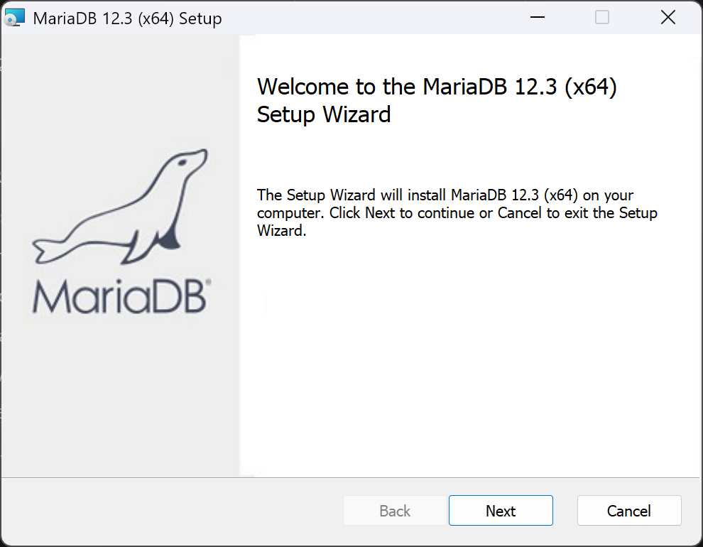

2. 同意最终用户许可协议

    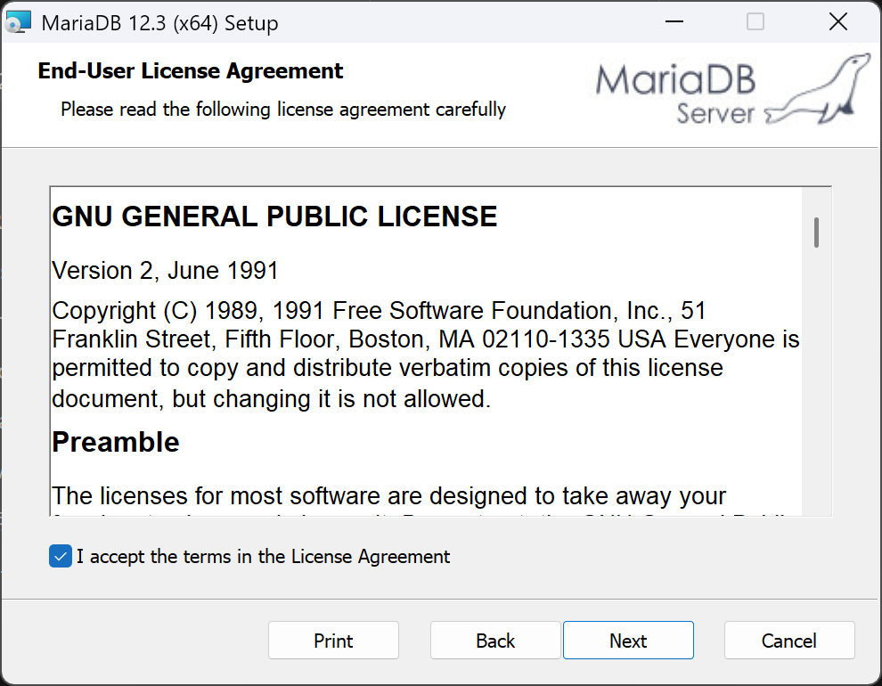

3. 选择功能和安装目录（Development components 和 Third party tools 可以不安装）

    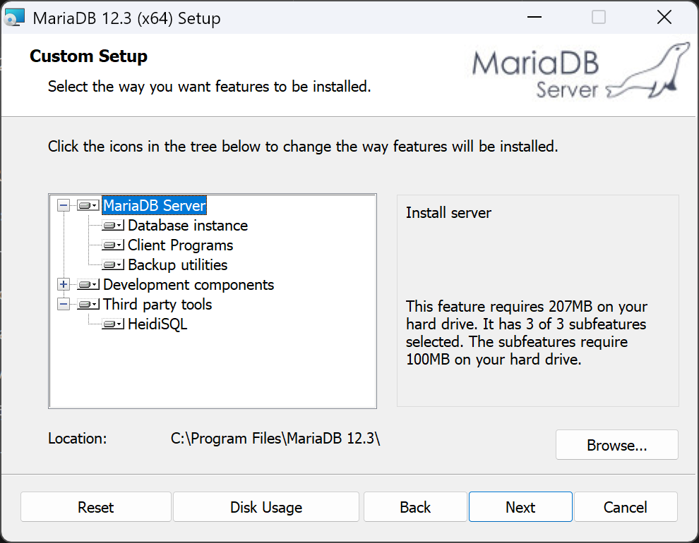

4. 为 `root` 用户设置密码和设置数据存储目录

    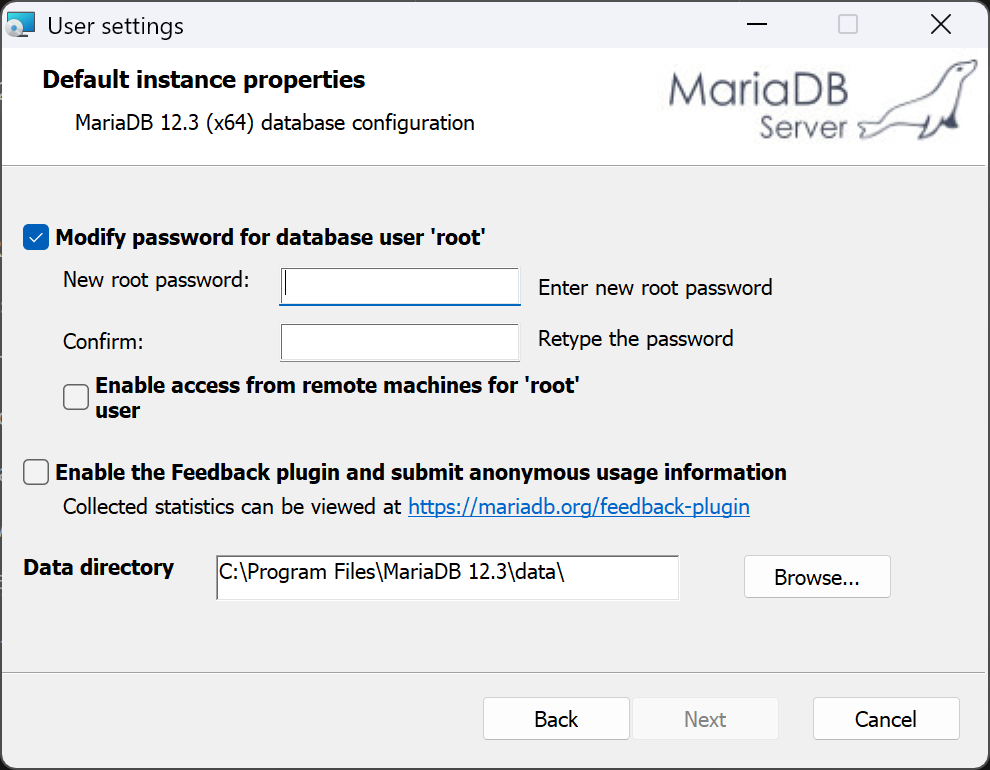

5. 将 `MariaDB` 配置为服务并设置端口

    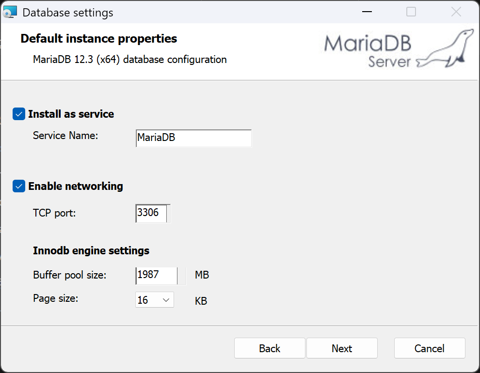

</Steps>

### Linux

<Steps>

1. 安装 `MariaDB`

    ```bash
    #适用于 Debian 系
    sudo apt install mariadb-server
    #适用于 Red Hat 系
    sudo dnf install mariadb mariadb-server
    ```

    安装后，运行命令设置根密码，删除匿名用户，并禁用远程 `root` 登录。

    ```bash
    sudo mariadb-secure-installation
    ```

2. 启动并验证服务：

    `MariaDB` 通常在安装后会自动启动。你可以查看状态，必要时手动启动。

    检查状态：

    ```bash
    sudo systemctl status mariadb
    ```

    启动服务（如果不运行）：

    ```bash
    sudo systemctl start mariadb
    ```

    通过连接 `root` 用户验证安装

    ```bash
    mariadb -u root -p
    ```

    输入你在安全安装时设置的 `root` 密码

</Steps>

### Docker

```bash
docker run --name=<容器名称> \
  -e MARIADB_ROOT_PASSWORD=<root用户密码> \
  --restart on-failure \
  -d \
  -p 3306:3306 \
  -v <数据在你机器上的存放位置>:/var/lib/mysql \
  -v <配置目录在你机器上的存放位置>:/etc/mysql/conf.d \
  mariadb:<版本号>
```

  </TabItem>

  <TabItem label="PostgreSQL">

### Windows

<Steps>

1. [下载](https://www.enterprisedb.com/downloads/postgres-postgresql-downloads) `PostgreSQL` 的安装程序并打开

    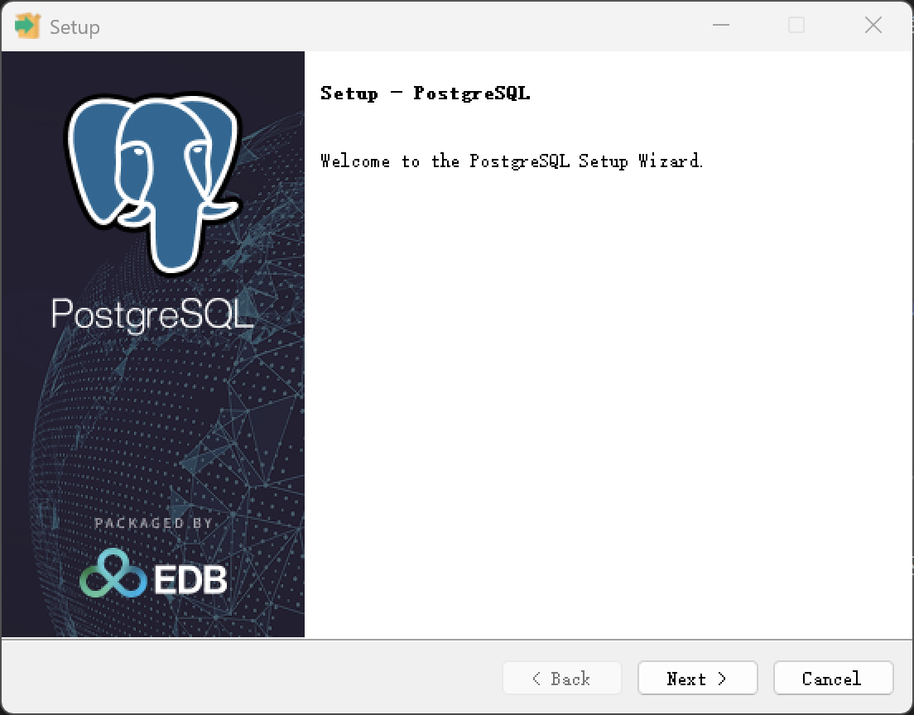

2. 设置安装路径

    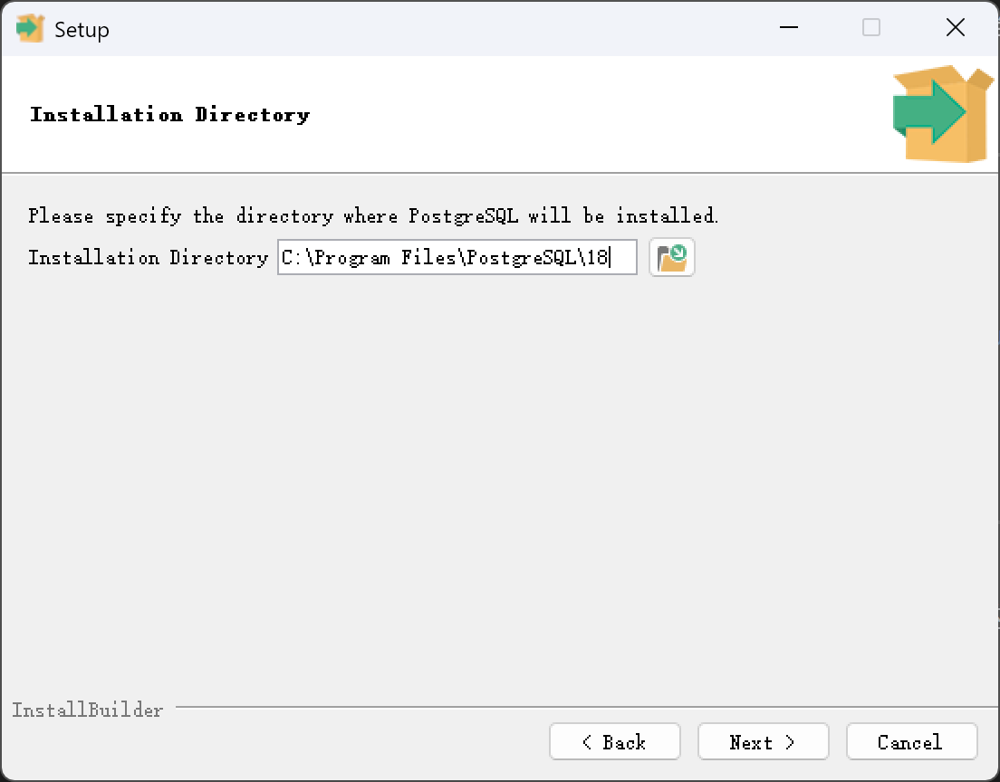

3. 选择要安装的功能

    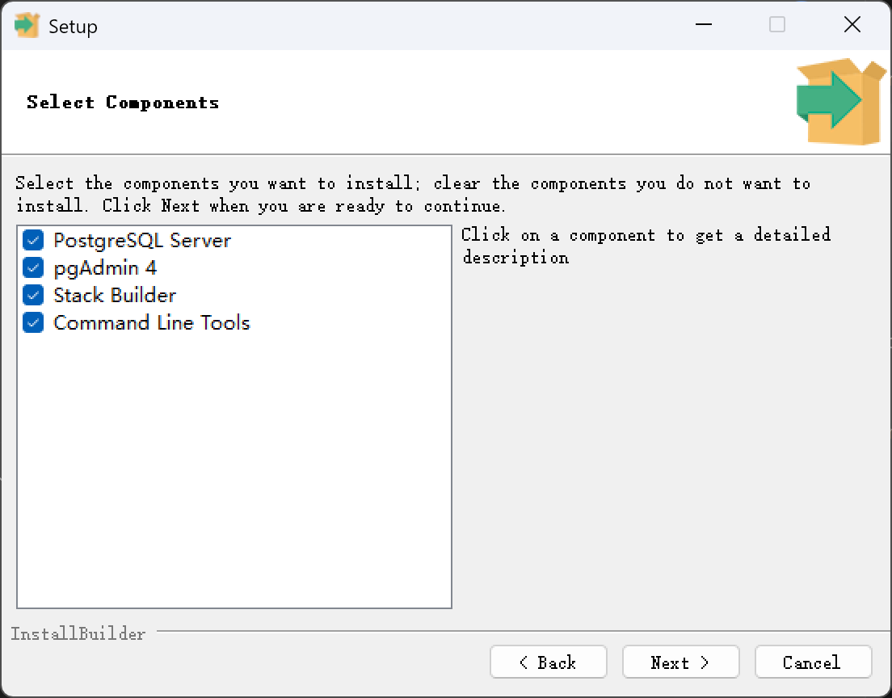

4. 设置数据存储目录

    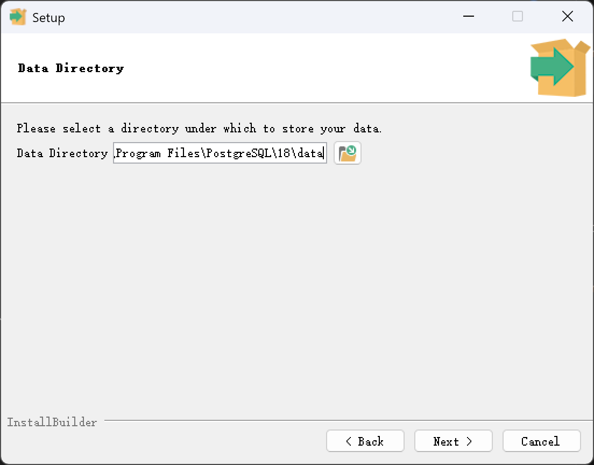

5. 设置 `root` 密码

    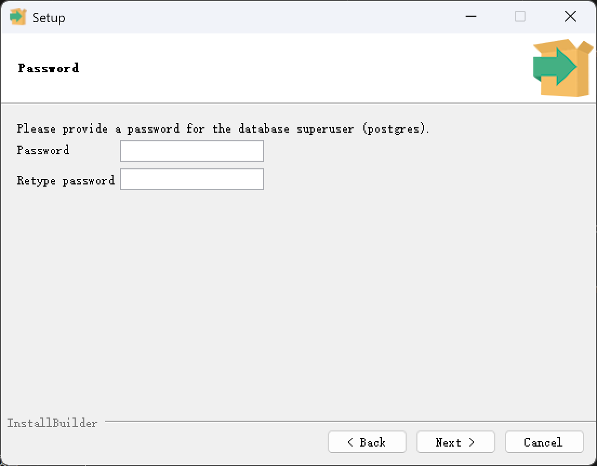

6. 设置服务端口

    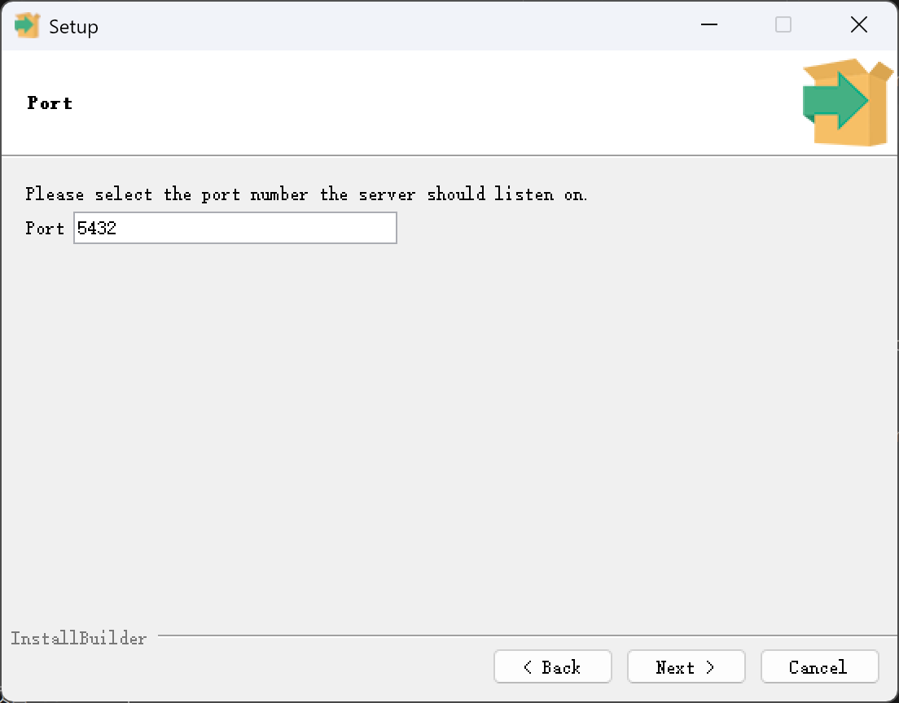

7. 设置地区

    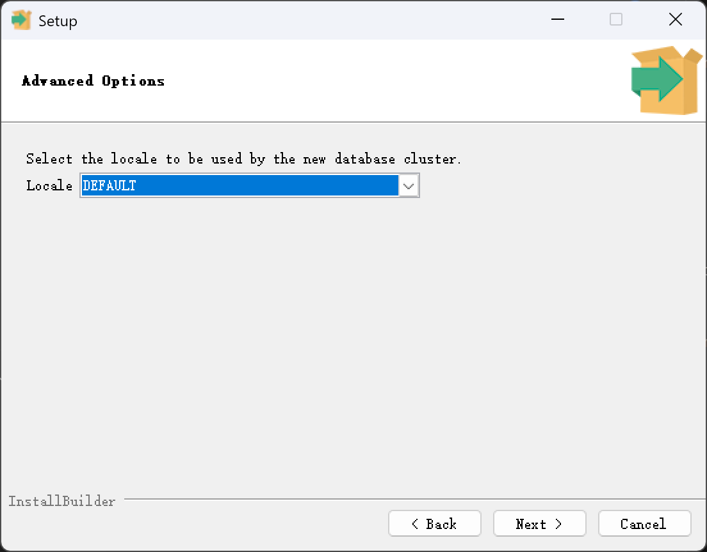

8. 只需要下一步你的安装就完成了

</Steps>

### Linux

```bash
#适用于 Debian 系
apt install postgresql
#适用于 Red Hat 系
dnf install postgresql-server
```

:::tip

想获得任何版本的 `PostgreSQL` 吗？

```bash
#适用于 Debian 系
sudo apt install -y postgresql-common
sudo /usr/share/postgresql-common/pgdg/apt.postgresql.org.sh
sudo apt update
sudo apt install postgresql-<版本号>
```

`Red Hat` 系需要去 `PostgreSQL` 的下载官网去生成脚本

:::

### Docker

```bash
docker run --name=<容器名称> \
  -e POSTGRES_PASSWORD=<root用户密码> \
  --restart on-failure \
  -d \
  -p 5432:5432 \
  -v <数据在你机器上的存放位置>:/var/lib/postgresql \
  postgres:<版本号>
```

  </TabItem>

  </Tabs>

## 使用工具安装

我会告诉你比较简单的几种安装数据库的方法

### PHPstudy

:::note

PHPstudy 仅支持 Windows 系统

:::

<details>
  <summary>从官网下载和安装</summary>


</details>

<details>
  <summary>卸载 MySQL5 和安装 MySQL8</summary>

MySQL5 版本太低了，很多插件需要更高版本的，装 MySQL8 就够用了


</details>

<details>
  <summary>初次启动</summary>

安装好后在首页启动 MySQL


更改 root 账户的密码

:::danger

不要设置过于简单的密码！

尤其是你打算把数据库开到公网，**绝对不要** 设置过于简单的密码！

**这真的很严重**

:::


然后你就可以建数据库了，建好之后把你填这里的信息填到插件的配置文件里

</details>

### 宝塔面板

:::note

宝塔面板支持 Windows 和 Linux 系统

:::

<details>
  <summary>从官网下载和安装</summary>


</details>

### 1Panel 面板

:::caution

1Panel 面板仅支持 Linux 系统，不支持 Windows 系统

:::

<details>
  <summary>安装，配置面板</summary>


</details>

<details>
  <summary>安装 MySQL</summary>


</details>
