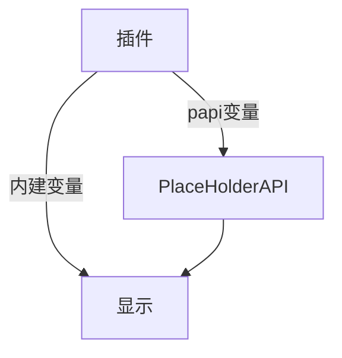

## 什么是变量？

这里指的变量是形似 `%player_name%`，即 `%xxx%` 的占位符

它们用来显示一些信息

如 `%player_name%` 是显示玩家名字

`%playerpoints_points%` 是显示 PlayerPoints 插件的玩家点券

## 变量怎么不显示


通常有以下几种情况：

1. 变量写错了
2. 没下载扩展
3. 没 `/papi reload`

这里讲解一下第二种情况：

在上方图片中，可以看到箭头所指一行是 `%vault_eco_balance%`

你需要安装 [Vault](/java/process/plugin/plugin-dependencies/vault/intro) 插件和 [经济插件](/java/process/plugin/plugin-dependencies/xconomy)

接着，确保你安装了 [PlaceHolderAPI](/java/process/plugin/plugin-dependencies/placeholderapi/intro) 插件，执行下方命令

```bash
/papi ecloud download Vault
/papi reload
```

然后你就可以看到变量了。


如果下载失败，看 [手动安装](#手动安装)

如果你想知道都有哪些扩展，提供了哪些变量，查看 [此处](https://continue-project.netlify.app/wiki/PlaceholderAPI/user-guides/placeholder-list.html)

## 什么是内建变量？



`build-in placeholder`，在此处我将其翻译为 "**内建变量**"。

指的是插件没有通过 PlaceHolderAPI，而是由自己实现的一种变量。通常，这类变量只有这个插件自己可以使用。

内建变量的形式多种多样，例如：`%player%` `{player}` `$1`。

一个插件可以同时拥有内建变量和 PlaceHolderAPI 变量，也可以只取其一（或者都没有）。

## 更改 boolean

```yaml title="plugins\PlaceholderAPI\config.yml"
boolean:
    "true": "yes"
    "false": "no"
```

将 yes 和 no 改为 true false

不改也没事，就是改成 true false 会更方便判断

## 在哪寻找我要的变量？

:::note

`Wiki` :https://wiki.placeholderapi.com/

`eCloud` :https://api.extendedclip.com/all/

`Placeholder List` :https://wiki.placeholderapi.com/users/placeholder-list/minecraft/

:::

## 怎么下载变量扩展？

```txt
/papi ecloud download 扩展名
```

然后执行命令 `/papi reload`

## 手动安装


看起来你连不上 ecloud

手动下载吧 https://api.extendedclip.com/all

把下载的 jar 文件塞到 `plugins\PlaceholderAPI\expansions` 文件夹

然后执行命令 `/papi reload`
